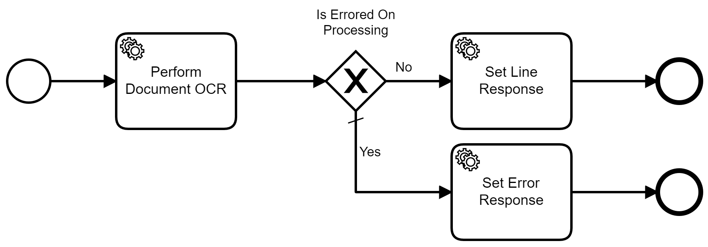
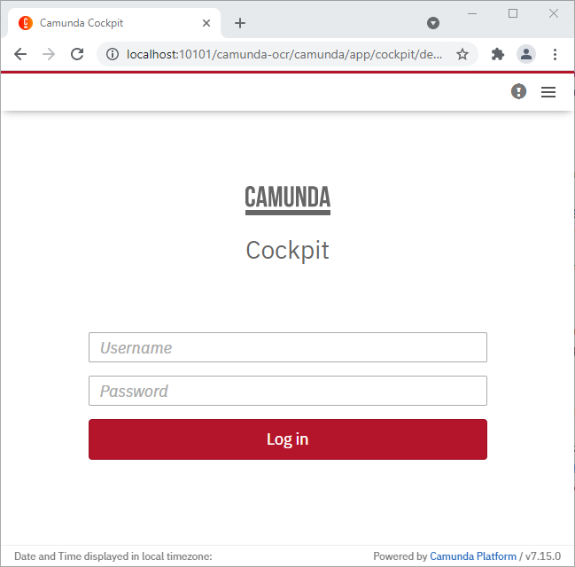
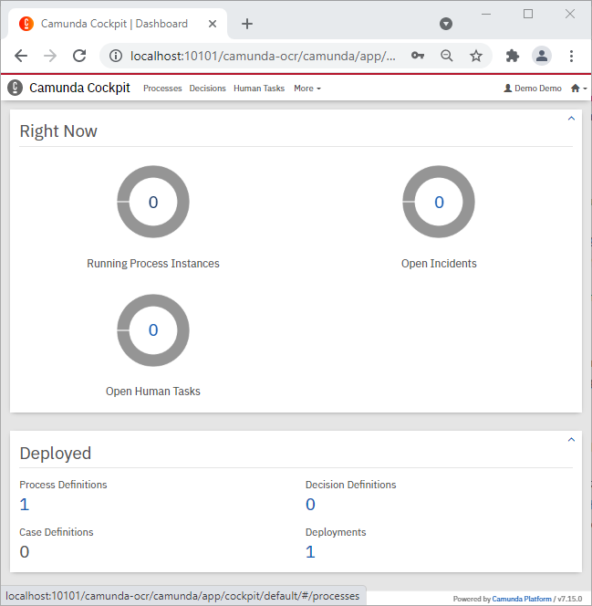
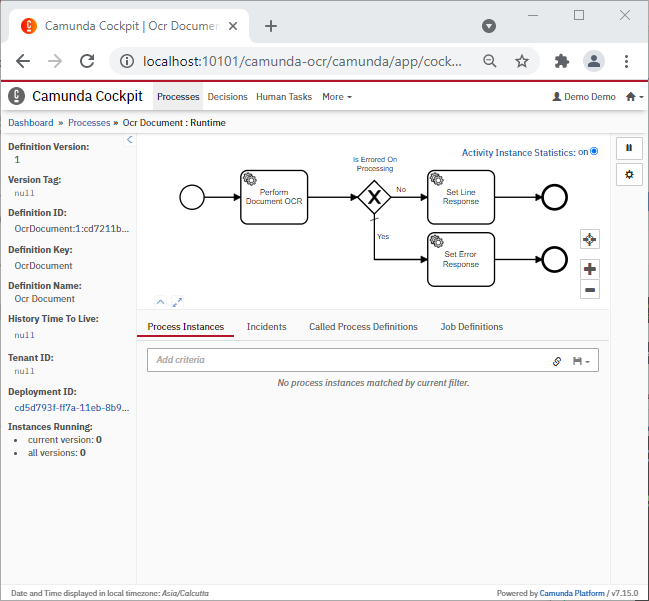

# OCR using Camunda Workflow
***


**_Powered by:_**  

## Introduction:
This standalone process application is being developed with [Kotlin](https://kotlinlang.org/docs/home.html) using [Camunda Workflow](https://camunda.com/) 
& [Springboot](https://spring.io/projects/spring-boot) with [JUnit5](https://junit.org/junit5/docs/current/user-guide/) Unit & Integration Test cases. 

For the use case, we will perform _ocr on a document using [OCR Space API](https://ocr.space/OCRAPI)_.

## OCR Space API

The OCR Space API provides a simple way of parsing images and multi-page PDF documents (PDF OCR).
The extracted text results will be returned in a JSON format.

To get a free version of API Key, you can register with your email at [OCR Space site](https://ocr.space/ocrapi#free)

The free OCR API plan we are using to demo the application, has 
* a rate limit of 500 requests within one day per IP address to prevent accidental spamming
* a limit of 25000 request per month
* a max file size of 1 MB
* a max of 3 pages can be OCRed per document 

You can check the API performance and uptime at the [API status page](https://status.ocr.space/)

**Note:** _The API Key that you have received from OCR Space would be set in [application.yaml](./src/main/resources/application.yaml) file_   
    
> `ocr-space.key` = _your_api_key_

## Camunda Workflow:
As per [Wikipedia](https://en.wikipedia.org/wiki/Camunda), Camunda Platform is an open-source workflow
and decision automation platform. Camunda Platform ships with tools for creating workflow and decision 
models, operating deployed models in production, and allowing users to execute workflow tasks assigned 
to them.

It is developed in Java and released as open-source software under the terms of Apache License. It 
provides 
* **Business Process Model and Notation** (BPMN) standard compliant workflow engine  
* **Decision Model and Notation** (DMN) standard compliant decision engine 
  
These can be embedded in Java applications and with other languages via REST. For more details on Camunda 
Workflow usage, you can refer to below blogs-
* [BPMN Engines: A Brief Introduction](https://medium.com/nerd-for-tech/bpmn-engines-a-brief-introduction-2123b5e15435)
* [Hands-on - Camunda Workflow Spring-Boot Application](https://medium.com/nerd-for-tech/bpmn2-0-camunda-workflow-spring-boot-application-2381f3d42e5f)  

Below is the workflow that we would use to understand use of Camunda Workflow to perform Document OCR using OCR Space API developed using Kotlin Language.


***
## Code Configuration

### Application Configuration
> Spring-Boot:  (v2.4.3)  
Camunda Platform: (v7.15.0)  
Camunda Platform Spring Boot Starter: (v7.15.0)

### Default Ports

On systems running the `API`, it is recommended to use the below port for starting an instance of the API.

> `10101` – default api listening port

### API Build & deploy from GIT repo
Below section would cover high level tasks required to configure and deploy api jar using Apache Maven

1. Clone repository on local system. By default, jars would be taken from Maven Central Repository.
2. Update properties in logback-spring.xml, application.yaml if applicable
3. Build with maven task `mvnw clean install`
4. Copy .jar file from /target/ to your `deployment-directory`
5. Environment specific `application.yaml` & `logback-spring.xml` are to be modified and placed in deployment-directory along with `.jar` if applicable
6. Start execution with `java -jar camunda-ocr-<version>.jar`
7. Logs are generated in deployment-directory/logs folder with file 
   name `camunda-ocr-logger.log` or as mentioned in `logback-spring.xml`

***

## Testing it out

### Run the Springboot application with maven

- You can follow above steps in order to compile, build, package and install jar using maven.

- Use command `mvnw clean install` to build and install the jar

- Use command `mvnw spring-boot:run` to run the springboot application.

- Alternatively you can navigate to file [Application.java](src/main/java/com/example/workflow/Application.java) and start the application.

- If every thing works then you should see below log in your console
```
2021-08-17 22:17:28,936 INFO  [main] org.springframework.boot.web.embedded.tomcat.TomcatWebServer: Tomcat started on port(s): 10101 (http) with context path '/camunda-ocr'
2021-08-17 22:17:28,960 INFO  [main] com.example.workflow.Application: Started Application in 21.931 seconds (JVM running for 23.514)
2021-08-17 22:17:28,966 INFO  [main] org.camunda.bpm.engine.jobexecutor: ENGINE-14014 Starting up the JobExecutor[org.camunda.bpm.engine.spring.components.jobexecutor.SpringJobExecutor].
2021-08-17 22:17:28,969 INFO  [JobExecutor[org.camunda.bpm.engine.spring.components.jobexecutor.SpringJobExecutor]] org.camunda.bpm.engine.jobexecutor: ENGINE-14018 JobExecutor[org.camunda.bpm.engine.spring.components.jobexecutor.SpringJobExecutor] starting to acquire jobs
```
- Refer to [running-your-application](https://docs.spring.io/spring-boot/docs/1.5.16.RELEASE/reference/html/using-boot-running-your-application.html) for more help with running boot application.

### Monitor Camunda processes using Cockpit & Trigger new Process using OAS

As we have used a custom type `file` the default camunda form does not allow to trigger the process from tasklist. However, we can use cockpit to monitor the process.  

#### 1. Open & Login Camunda in Browser

- On your local machine, you can access Camunda using [Camunda Home Page](http://localhost:10101/camunda-ocr) url
- Credentials are configured in [application.yaml](./src/main/resources/application.yaml) file in key `camunda.bpm.admin-user`. Default credentials are
  > `username:` demo   
  `password:` demo



#### 2. Navigate to Camunda Cockpit to monitor the flow

- `Cockpit` helps us to visualise which step our process is. It would also give us the process instance id along with other variables saved in the process.



- You can now click on `Running Process Instance` > `Ocr Document` Process Definition to view the running processes.



_**Note**: You may not see the running process as it completes very quick._

#### 3. To perform document ocr, Open Swagger API Browser

- URL to access [Swagger OpenAPI Apecification](http://localhost:10101/camunda-ocr/swagger-ui.html)

#### 4. Use Try it out to test the API

- Click on `Try it out` in right corner to enable the API.

- Click `Browse` to upload a file

- Click `Execute` to send the request. You can check the response which is processed via triggering a camunda workflow.

- If you want to read more about swagger, then you can go through blog 
  - [OAS Swagger UI Setup](https://medium.com/nerd-for-tech/open-api-specification-swagger3-fc9ad3bbacdd)
  - [OAS Swagger Authentication](https://medium.com/nerd-for-tech/openapi-specification-swagger-authentication-c150f86748ea)

### Postman Collection 

In addition, we have added [postman collection](./documentation/testing/Camunda%20Document%20OCR.postman_collection.json) which can be used to test the API in your local environment. 

You would require to have OCR Space key as defined in above section, and a document which is less than 1 MB in size and not more than 3 pages.  

### Check Logs

- In the end, all the steps we did will be tracked via the logs in the console. If you filter the logs using keyword `workflow-service-info` then you would see below


Logs for **End to End Process**
```
2021-08-17 23:35:35,534 INFO  [http-nio-10101-exec-1] com.example.workflow.controller.DocumentOcrController: Timestamp:1629223535534:workflow-service-info:OCR Request received:File: images.jpg
2021-08-17 23:35:35,545 INFO  [http-nio-10101-exec-1] com.example.workflow.service.DocumentOcrService: Timestamp:1629223535545:workflow-service-info:Prepare & Send Request:Process instance id b8765ce0-ff85-11eb-8bbb-dc7196c5d636
2021-08-17 23:35:37,670 INFO  [http-nio-10101-exec-1] com.example.workflow.service.DocumentOcrService: Timestamp:1629223537670:workflow-service-info:Document OCR:Response Data received
2021-08-17 23:35:37,685 INFO  [http-nio-10101-exec-1] com.example.workflow.service.ProcessOcrResponse: Timestamp:1629223537685:workflow-service-info:Prepare & Cleanup Response:Process instance id b8765ce0-ff85-11eb-8bbb-dc7196c5d636
2021-08-17 23:35:37,707 INFO  [http-nio-10101-exec-1] com.example.workflow.controller.DocumentOcrController: Timestamp:1629223537707:workflow-service-info:Camunda Workflow Completed:Instance Id: b8765ce0-ff85-11eb-8bbb-dc7196c5d636
```

_Thus, we have implemented Document OCR using Kotlin and Camunda Workflow!!_

***
### Appendix - Deployment as Docker container

To deploy API as Docker Container refer [Docker-Image-Deployment](./documentation/deployment/Readme.md)
